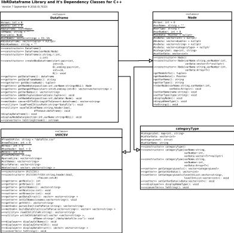

Source File: category.cpp

## A Categorical or "Factor" data type class for C++

@author David York

@date Friday September 9, 2016

@version 0.303

@brief  The categoryType creates a category variable (vector) and provides utilities for a categorical or factor datatype (similar to R's factor type).

The utilies allow construction, and population of data type based a vector of factors. There are also functions included to convert factor variables to and from int and string variable collections.

The best model to use was considered to be the open source R factor type. In Addition to constructors, utilities to manipulate this variable type are needed.

