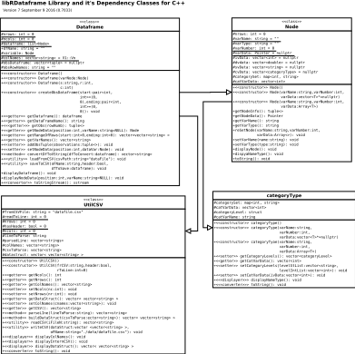

##Node Class

@brief Creates a Node class to contain the data and meta-data of a variable

The Variable Nodes ultimately formpart of the Dataframe class which is simply a vector of Nodes.
  
It's data, is implemented as a pointer to a vector containing the data.
  
In an Abstract sense, the Nodes are the variables, as contained for example in a vector of Nodes which is the Dataframe structure. The meta-data defines the variable fully and a void* pointer to a vector<any> containing the observation data of the#include "dataframe.cpp" variable.
  
Class methods allow maintenance and manipulation of the variable it's data as to variable name, variable (data) type variable id (or position) within any containing structure and the observation data itself.

